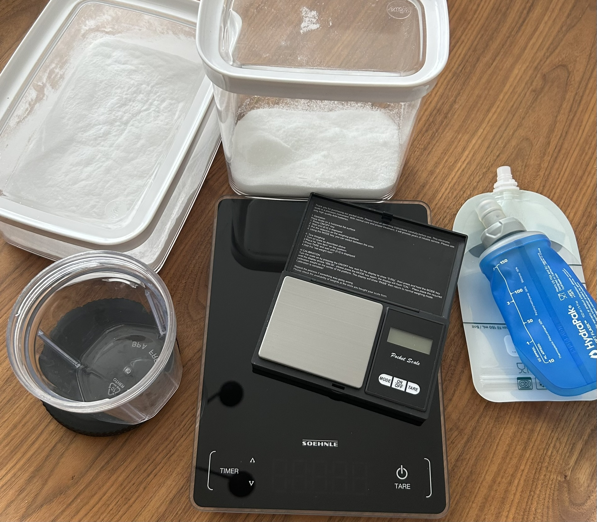
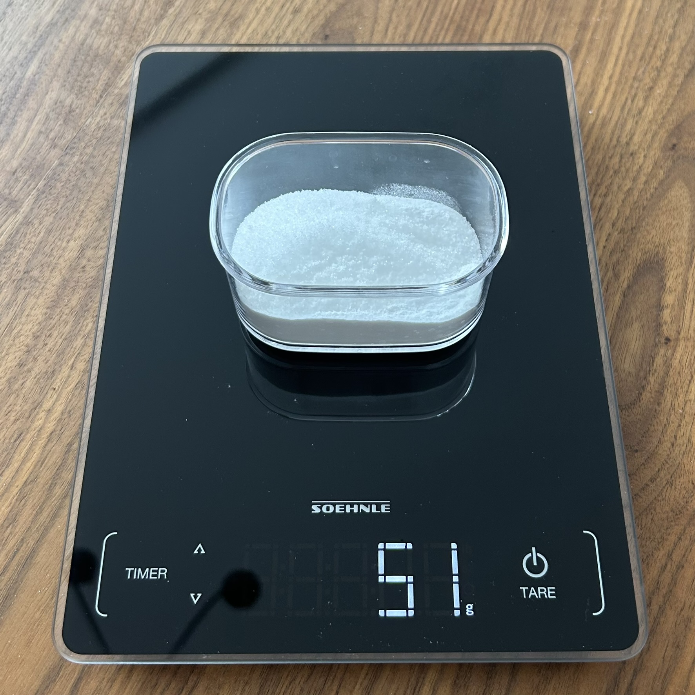
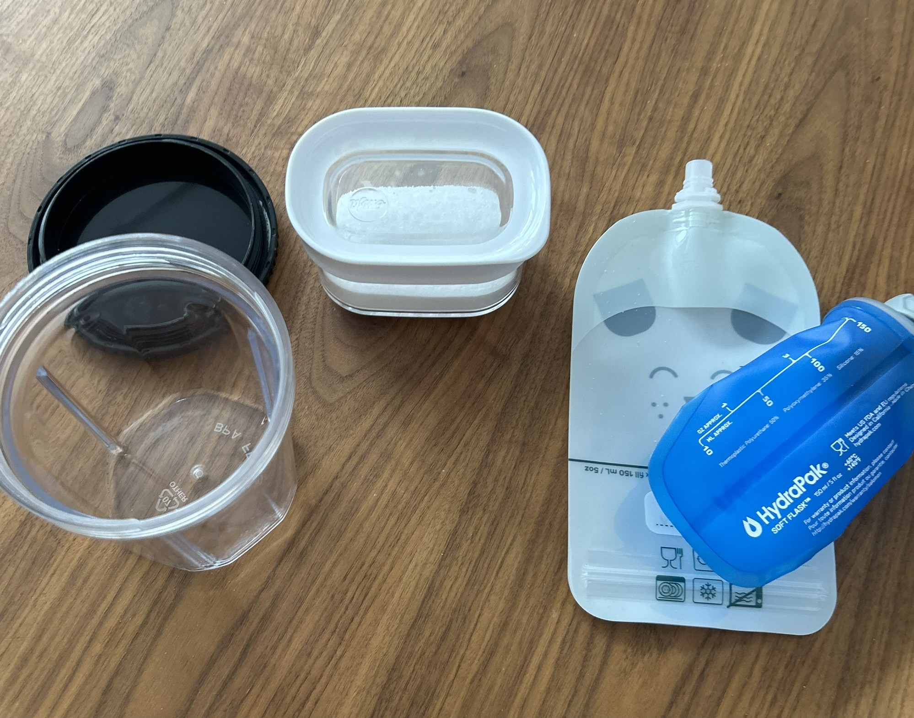
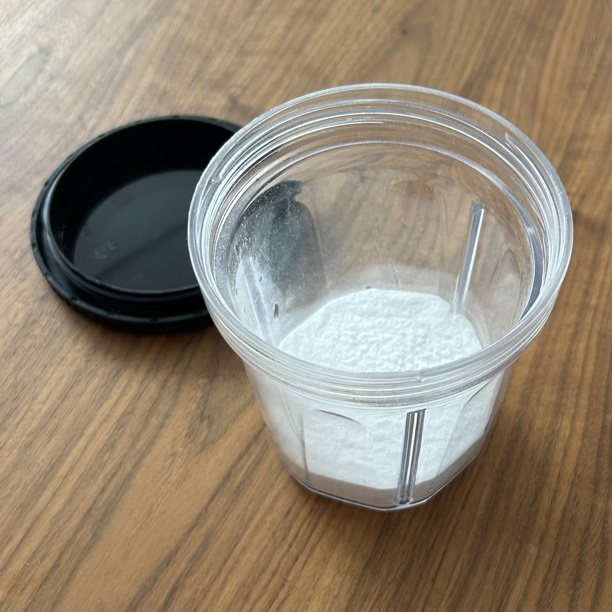
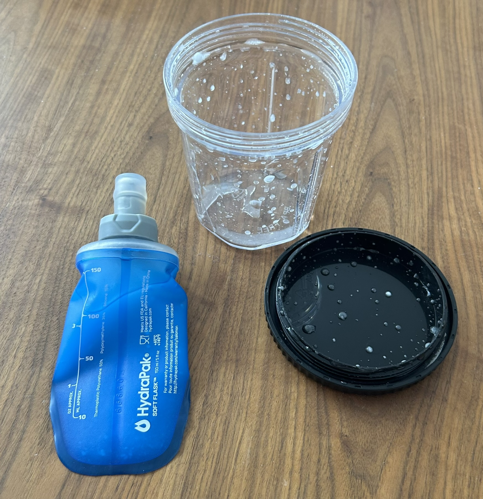

Energy gels are a massive part of marathon running—not just on race day, but during training too. If you're piling on the miles, you should even be using them on your easy runs. Want the details? Check out [this post](/endurance/why-you-should-fuel-during-every-run-a-runners-guide-to-carbohydrates/) I wrote about it.

But here’s the kicker: these gels are outrageously expensive. A Maurten gel will cost you about €3.40—14 cents per gram of carbohydrate. Even the cheaper Decathlon ones are €1.70, or 7 cents per gram. And the packaging? Total pain—you have to down the whole sachet in one go since there’s no resealing it. For someone like me, using gels every day in training, that’s at least €12 a week. And that’s a lowball estimate because 25g of carbs per sachet? Barely scratches the surface.

Then there’s the hassle of testing which gels your stomach can tolerate, planning based on carb content, and having no say over what’s actually in them. So, what’s the fix? Simple: make your own.

For the last six months, I’ve been whipping up my own gels, and I’ve downed way more homemade stuff than the store-bought kind. Honestly, I can’t even recall the last time I squeezed one of those plastic sachets into my mouth. Maybe it was that half-marathon where I overpaced, snagged one from an aid station, and prayed it’d pull me out of the slump.

## The Basic Recipe

Let’s cut to the chase. The recipe for homemade energy gels is dead simple:

- 1 part maltodextrin
- 0.8 parts crystalline fructose
- 2-4g salt (optional—I’m skeptical sodium does much during a race and in general I prefer to get my electrolytes after workouts)

This 1:0.8 ratio of maltodextrin to fructose is key because it optimizes carbohydrate absorption. Maltodextrin breaks down into glucose, which is absorbed via the SGLT transporter, while fructose uses the GLUT5 transporter. By combining both, you can maximize the use of these different pathways, allowing you to consume more carbs per hour without stressing your gut. I’ve personally tested this up to 120g per hour with no issues.

To make it easy, here’s a table for different carb goals:

| Carbohydrate Goal (g) | Maltodextrin (g) | Fructose (g) |
| --------------------- | ---------------- | ------------ |
| 20                    | 11.3             | 8.9          |
| 30                    | 17.0             | 13.3         |
| 40                    | 22.7             | 17.8         |
| 50                    | 28.3             | 22.2         |
| 60                    | 34.0             | 26.7         |
| 70                    | 39.7             | 31.1         |
| 80                    | 45.4             | 35.6         |
| 90                    | 51.0             | 40.0         |
| 100                   | 56.7             | 44.4         |
| 110                   | 62.4             | 48.9         |
| 120                   | 68.0             | 53.3         |

*Note:* The gram totals might look off because maltodextrin has ~0.98g of carbs per gram. Math, right?

Too lazy to calculate? Use [my gel calculator app](/gel-calculator) instead.

## Cost Comparison

Let’s break down the cash factor:

- **Maurten gels:** €13.60 per 100g of carbs
- **Decathlon gels:** €6.80 per 100g of carbs
- **Homemade mix:** Around €2.13 per 100g of carbs

And if you go big—say, 10kg of maltodextrin at €3 per kg and 5kg of fructose at €5.60 per kg—you’re down to just €0.43 per 100g. That’s a jaw-dropping 97% savings!

## How to Prepare the Gel

Here’s the step-by-step to turn powder into marathon fuel:

1. **Mix the powder:** Blend the maltodextrin, fructose, and salt (if you’re into that) using the ratios above. Store it as a dry mix for later. Fair warning: traveling with this stuff might raise eyebrows—looks like I’m smuggling *another* white powder to races!

2. **Make it a gel:** Grab a sealable water bottle. Funnel the powder in (a rolled-up paper works if you’re low-tech). Add warm water bit by bit, shaking after each splash, until it’s a gel you can stomach. I use the 150ml volume of my Hydra Flask as a mark—good for up to 120g of carbs.

3. **Pick your container:** Once it’s dissolved, transfer it to whatever works: a 150ml Hydra Flask, reusable squeeze pouches, or even ziplock bags.

For regular training, I just keep it in the bottle and sip it like a drink mix. No extra water bottle needed—boom, efficiency.

## Customization and Future Plans

This recipe’s a starting point—tweak it to fit your needs. That’s why I built [my gel calculator app](/gel-calculator) to simplify the math.

Down the road, I’m itching to try “natural” gels. Picture this: pureed bananas, raisins, and potatoes for a real-food vibe instead of straight sugar. Tasty, right? Watch this space!

So, there you go—a cheap, easy way to power your marathon training. Try it out, and hit me up with how it goes. Oh, and don’t sleep on that gel calculator app—it’s a game-changer.
