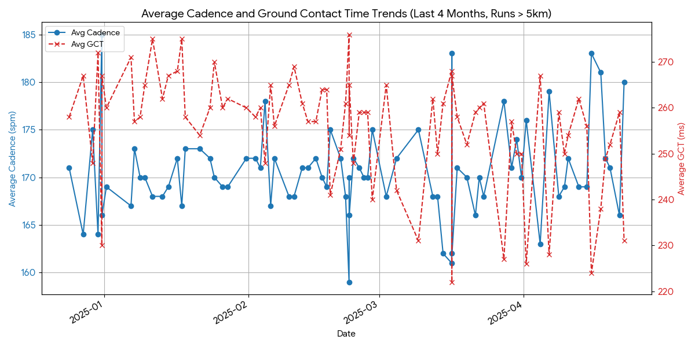
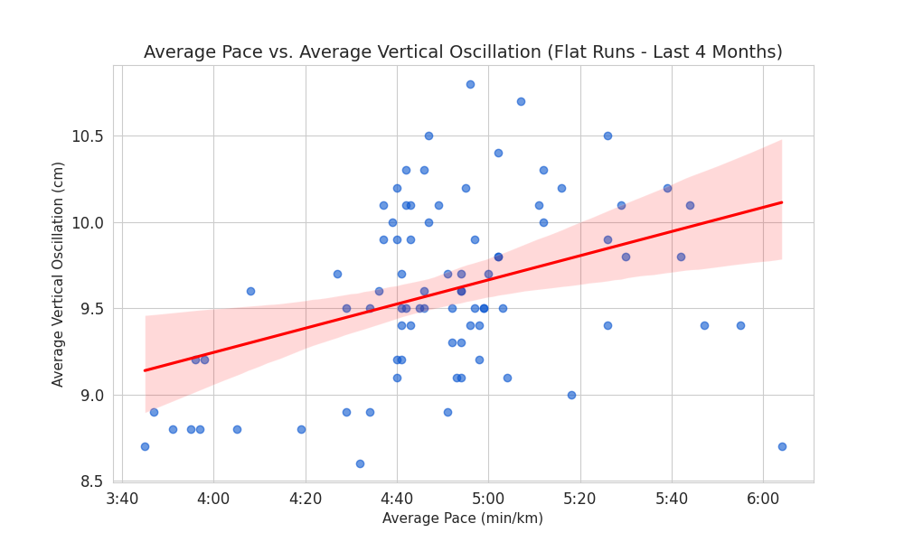
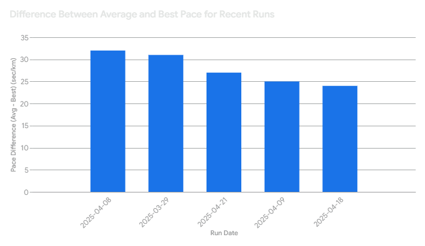

## Garmin's "Premium" AI is... Well, Not That Intelligent

So, Garmin rolled out a premium service featuring a fancy dashboard and their very own "Active Intelligence." Sounds cool, right? Except, this AI is... honestly, pretty bad. It basically just regurgitates stuff you can already see plain as day. Today, it graciously informed me that my energy level is high and my sleep was good. Wow, thanks, Captain Obvious!

And don't get me started on the running analysis. After my last ten runs, the AI *helpfully* pointed out *every single time* that my GCT Balance is 51% on the right and I need to "improve my running form." Look, maybe there *is* room for improvement, but hearing the exact same thing daily isn't exactly groundbreaking insight. You definitely didn't need an AI for that level of feedback.

## Why Did Garmin Even Bother?

Let's be real: "AI" is the buzzword of the decade. My guess? Some manager had "Implement AI" slapped onto their performance goals and rammed it through, regardless of whether it was actually useful or, frankly, a bit pointless.

Now they can boast to shareholders about their cutting-edge AI and how millions of users are *totally* embracing the paid Garmin Connect+ (because, you know, free trials exist). Mission accomplished for the manager, who's probably already angling for a promotion and moving on to the next buzzword, leaving the developers and support team to deal with the fallout. Okay, rant over... for now.

## Why Do I Keep Getting the Same Generic Advice?

Garmin is likely using some Large Language Model (LLM) and feeding it the same handful of prompts over and over. The variety in AI responses directly correlates with the variety in the prompts used. My gut feeling? "Active Intelligence" is working off maybe 10 different prompt templates.

Add likely caching into the mix – saving answers for common prompts. If one person gets an analysis for "8 hours sleep with 2 hours deep sleep," that answer gets stored. The next dozen people with similar sleep stats? They probably get the exact same cached response. Efficient? Maybe. Insightful? Hardly.

## Okay, Enough Complaining – How Do We Make It Better?

Garmin isn't *all* bad. One genuinely useful feature is the ability to export the raw data for *all* your activities as a CSV file via the activities page ([https://connect.garmin.com/modern/activities](https://connect.garmin.com/modern/activities)). Yes, you have to scroll all the way down to load all activities, but it's way easier than with some other platforms.

And guess what? LLMs are pretty darn good at munching on CSV data! We can simply feed our exported data to an AI model *of our choice* and ask the questions *we* actually care about. Even better, we can ask follow-up questions based on the initial findings.

The best part? **We control the output.** We can tell the LLM *what* to do with the information: just report the facts, suggest specific changes, or brainstorm potential reasons behind the patterns it finds.

## Essential Background Info for Your Prompts

To give the LLM proper context, always include these basic details about yourself:

* Age
* Weight
* Height
* Gender
* Max Heart Rate (MaxHR)
* Resting Heart Rate
* How long you've been running seriously (e.g., "since 2020")
* 5K Personal Best (PB)
* 10K PB
* Half Marathon (HM) PB
* Marathon (M) PB
* Lab-tested VO2Max (if available)
* Lab-tested Threshold Pace (if available)
* Garmin estimated VO2Max
* Garmin estimated Threshold Pace

**Your initial prompt should start something like this:**

``I am a [Short-distance/Mid-distance/Long-distance] runner. I am [XX] years old, [Male/Female/Other], [XXX]cm tall, and weigh [XX]kg. My maximum heart rate is [XXX]bpm, and my resting heart rate is [XX]bpm. I have been running structurally since [YYYY]. My personal bests are: 5K [MM:SS], 10K [MM:SS], HM [HH:MM:SS], M [HH:MM:SS]. My [Lab-measured/Garmin-estimated] VO2Max is [XX], and my [Lab-measured/Garmin-estimated] Threshold Pace is [MM:SS]/km.``

This context is crucial for the LLM to provide relevant analysis.

## 5 Useful Prompt Add-ons

Want more than just data summaries? Try adding these to your prompts:

1. "Suggest what I can change."
2. "What are possible reasons for these correlations/patterns?"
3. "What are specific recommendations to help me improve?"
4. "Analyze the potential impact of [specific factor, e.g., 'my cadence'] on my performance."
5. "Compare my [metric] to typical ranges for runners like me."

## 9 Killer Prompts to Get You Started

Here are nine prompts to kickstart your personalized analysis using your Garmin CSV data and an LLM like Google Gemini, Claude, or ChatGPT. Each includes the prompt, the justification, and an example result snippet (I used Google Gemini 2.5 Pro for these, asking for a concise summary and one chart).

*(Note: You'll need to upload your CSV file to the LLM interface or ensure it can access the data).*

---

### 1. Performance Trend Analysis

* **Prompt:** `"Analyze my running data from the provided CSV. Identify trends in my Average Pace over the last 3 months for runs between 8 km and 12 km. Consider only 'Run' Activity Type. Plot the trend and provide a summary of whether my pace for this distance range is improving, declining, or staying consistent."`
* **Justification:** Checks your performance trend for a specific, comparable type of run (moderate distance), making it easier to see real changes. Requests a visual plot and clear summary.
* **Example Result Snippet:**

    ``Based on the analysis of your running data from the last 3 months, here is the trend for your average pace on runs between 8 km and 12 km: [Chart showing pace trend].
    Summary: Your average pace for runs between 8 km and 12 km over the last 3 months shows a slight improving trend.``

    

---

### 2. Effort-Performance Correlation (Aerobic Efficiency)

* **Prompt:** `"Examine the relationship between Average Heart Rate and Average Pace for all my runs classified as 'Easy Run' (or specify criteria like 'runs with Average Heart Rate below [Your Zone 2/3 upper limit] bpm') over the past 6 months. Is there evidence of improved aerobic efficiency (i.e., lower Average Heart Rate for the same Average Pace, or faster Average Pace for the same Average Heart Rate)? Calculate and plot the trend of an Efficiency Factor (defined as Average Pace converted to m/s divided by Average Heart Rate) over this period."`
* **Justification:** Investigates aerobic efficiency, a key fitness marker. Focusing on easy runs makes heart rate a more reliable intensity indicator. Requires you to define 'Easy Run' or provide your HR zone limit.
* **Example Result Snippet:**

    ``Based on the analysis of your easy runs (Average HR < 146 bpm) over the last six months, here is the trend of your Aerobic Efficiency Factor: [Chart showing Efficiency Factor trend].
    Your aerobic efficiency shows a clear positive trend over the analyzed period, indicating you are running faster at the same average heart rate, or maintaining the same pace with a lower average heart rate.``

    

---

### 3. Running Form Analysis (Cadence & GCT)

* **Prompt:** `"Analyze my Cadence (Running) and Average Ground Contact Time (GCT) trends over the last 4 months for runs longer than 5 km. Is there a correlation between changes in my average cadence and average GCT? Plot both trends over time on the same graph if possible, and discuss any observed relationship."`
* **Justification:** Explores the relationship between two key form metrics often linked to efficiency (higher cadence often correlates with lower GCT).
* **Example Result Snippet:**

    ``Over the last four months, your running data for activities longer than 5 km shows a strong negative correlation (-0.84) between average cadence and average ground contact time (GCT), meaning as your cadence generally increased, your GCT decreased, as illustrated in the plot: [Chart showing Cadence and GCT trends].``

    

---

### 4. Form Efficiency Analysis (Vertical Oscillation & Ratio)

* **Prompt:** `"Analyze my Average Vertical Oscillation (VO) and Average Vertical Ratio (VR) for runs on relatively flat terrain (e.g., Total Ascent < 50m per 10km) over the last 4 months. How do these values compare to typical ranges (e.g., VO: 6-10cm)? Is there a trend over time? Is there a correlation between my Average Pace and these metrics on these flat runs?"`
* **Justification:** Focuses on vertical efficiency metrics, which impact running economy. Controlling for terrain (flat runs) helps isolate biomechanical factors. Compares to benchmarks and explores relationships with pace.
* **Example Result Snippet:**

    ``Analyzing your VO and VR on flat runs (<50m ascent/10km) over the last 4 months: [Chart showing VO/VR vs Pace or Time]. Your average VO is [X.X]cm, generally within typical ranges. The plot shows a weak positive correlation between average pace and vertical oscillation on these flat runs, suggesting slightly higher bounce when running slower.``

    

---

### 5. Pacing Consistency Analysis

* **Prompt:** `"Select 3-5 recent runs of similar distance (e.g., 10-15 km) and relatively flat terrain (e.g., Total Ascent difference < 50m across the runs). Analyze the pacing consistency within each run. If lap data (e.g., pace per km/mile) is available and interpretable in the CSV, calculate the standard deviation of lap pace for each run. If not, analyze the relationship between Best Pace and Average Pace for each run. Compare the consistency across these similar runs."`
* **Justification:** Evaluates your ability to maintain an even pace, crucial for racing and efficient training. Acknowledges that detailed lap data might not always be easily usable from the CSV.
* **Example Result Snippet:**

    ``Comparing three recent flat 10k runs: [Chart or table showing Pace SD or Avg Pace vs Best Pace]. Your most recent runs from mid-April 2025 show a slightly smaller gap (24-27 seconds/km) between your average pace and your best pace compared to the runs from late March/early April 2025 (31-32 seconds/km), suggesting slightly less extreme pace variation recently based on this metric.``

    

---

### 6. Goal-Oriented Plan Generation

* **Prompt:** `"Based on the analysis of my past training data [Optional: 'especially considering the findings from the previous analysis regarding effective methods for me'], propose a [Number]-week training plan to help me achieve [Your Specific Goal, e.g., 'run a sub-50 minute 10k', 'complete my first half marathon']. My target event date is [Date, if applicable]. I can realistically train [Number] days per week, with approximately [Time commitment] available per session. Please specify: Weekly schedule (types of runs: easy, tempo, intervals, long run, recovery), Target pace ranges or heart rate zones for each run type (derived from my current fitness in the data), Suggested weekly mileage progression, and Incorporate insights from my cadence/form metrics if relevant."`
* **Justification:** Leverages the AI's ability to synthesize your data and goals into a structured plan.
* **Example Result Snippet:** (Showing mileage progression only for brevity)

    ``Here is a proposed 16-week mileage progression for your sub-75 minute Half Marathon goal: [Chart showing weekly mileage build-up]. The full plan includes specific easy, tempo, interval, and long run workouts tailored to your current fitness...``

    

---

### 7. Improving Specific Weaknesses

* **Prompt:** `"The previous analysis suggested my [e.g., 'cadence is consistently low', 'heart rate stays high on easy runs', 'pace fades significantly on long runs']. Based on my full data history, propose specific workouts or adjustments to my weekly training structure over the next [Number] weeks to target improvement in this area, while still working towards my overall goal of [Your Goal]."`
* **Justification:** Uses the AI to create targeted interventions based on identified weaknesses from prior analysis.
* **Example Result Snippet:** (Too detailed for a snippet, usually provides specific drills or workout modifications)

    ``To address your consistently low cadence, here are specific drills and workout adjustments for the next 4 weeks... [Details on cadence drills, integrating them into runs, etc.]``

---

### 8. Optimizing Training Mix (Intensity Distribution)

* **Prompt:** `"Analyze the distribution of my training intensity based on Heart Rate zones (if possible to estimate from Avg/Max HR and Resting HR in the data) or Pace zones across my historical data. Compare this to commonly recommended distributions (e.g., 80/20 polarized training). Based on my performance trends and goal of [Your Goal], recommend an optimal intensity distribution mix (e.g., percentage of time/sessions in easy, moderate, hard zones) for my future training. Structure a sample training week reflecting this mix."`
* **Justification:** Helps determine if your training balance (e.g., easy vs. hard efforts) is appropriate for your goals, moving beyond just volume.
* **Example Result Snippet:** (Too detailed for a snippet, provides zone breakdowns and sample week)

    ``Your historical training intensity distribution appears to be approximately 65% Easy, 25% Moderate, 10% Hard based on estimated HR zones. For your goal of [Your Goal], shifting towards an 75/15/10 or 80/10/10 polarized model might be beneficial... Here is a sample week reflecting an 80/10/10 split... [Details of sample week]``

---

### 9. Injury Risk Factor Identification (Use with Caution!)

* **Prompt:** `"Analyze my training load (e.g., weekly mileage, significant increases in mileage or intensity) and any recorded metrics like GCT Balance or Vertical Ratio over the past 6-12 months. Are there any patterns that might correlate with periods of increased injury risk (e.g., rapid mileage increases followed by dips in activity, consistently high asymmetry in GCT Balance)? [Optional: Mention any known injury periods if you recall them]."`
* **Justification:** Explores potential correlations between training patterns/biomechanics and potential injury risk factors.
* **Example Result Snippet:**

    ``Analyzing your training load and GCT Balance: [Chart showing mileage/intensity vs. GCT Balance over time]. There was a period in [Month, Year] where weekly mileage increased by over 30% for two consecutive weeks, which coincided with your highest recorded GCT imbalance (52.5% Right). While correlation doesn't equal causation, such rapid load increases combined with asymmetry are sometimes associated with increased injury risk.``

---

So there you have it. Stop relying on Garmin's underwhelming AI and start digging into your *own* data. Export that CSV, fire up your favorite LLM, and get some *actually* useful insights tailored to *you*. Happy analyzing!
